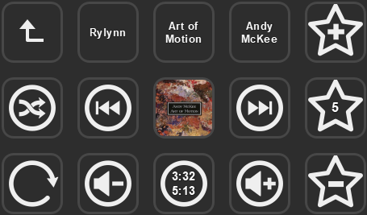

# Mediamonkey 5 Stream Deck integration

Control Mediamonkey 5 with real-time feedback on your Elgato Stream Deck device.

 

 

## Installation

1. Install [mediamonkey5](https://www.mediamonkey.com/download).
2. Install one of the [releases](https://github.com/sam-horne/streamdeck-mediamonkey5/releases) of streamdeck-mediamonkey5.
3. Add desired actions to control Mediamonkey 5 from the streamdeck.

## Features
* Control playback
  * Play
  * Pause
  * Stop
  * Previous/next track
  * Add tracks to now playing from:
    * Album
    * Artist
    * Playlist
  * Shuffle status
  * Repeat status
  * Volume and mute
  * Seek forwards or backwards
* Display information of current track
  * Title
  * Album
  * Artist
  * Album artwork
  * Rating
  * Track length
* Modify tracks
  * Increase or decrease rating of current track
* Modify playlist
  * Add or remove current track

Mediamonkey integration is implemented through the javascript [API](https://www.mediamonkey.com/docs/api/) using the Chrome DevTools protocol.

## Credits
[David Borzek (streamdeck-foobar2000)](https://github.com/davidborzek/streamdeck-foobar2000)
